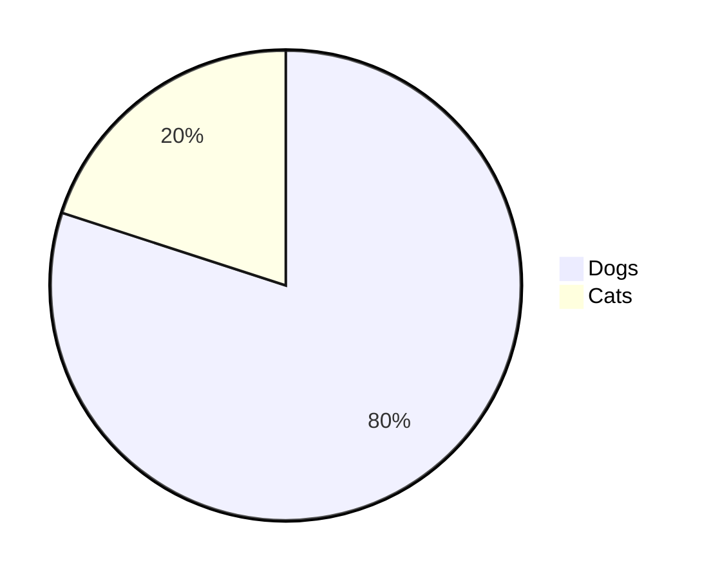

<a name="top"></a>

<h1 align="center">
ReadMe Cheat sheet
</h1>

<br/>

> [!IMPORTANT]
> Check out the official documentation on [GitHub](https://docs.github.com/en/get-started/writing-on-github/getting-started-with-writing-and-formatting-on-github/basic-writing-and-formatting-syntax) to learn more.

Markdown is a lightweight markup language for creating formatted text using a plain-text editor. John Gruber and Aaron Swartz created Markdown in 2004 as a markup language that is intended to be easy to read in its source code form.
This cheat sheet is here to provide you with a comprehensive understanding of the main commands in Markdown, it's aimed at enhancing your GitHub README.


- [Headings](#headings)
- [Text styles](#text-styles)
- [Syntax Highlighting](#syntax-highlighting)
  * [Inline code](#inline-code)
  * [Code block](#code-block)
  * [Diff Code block](#diff-code-block)
- [Alignments](#alignments)
- [Tables](#tables)
- [Links](#links)
  * [Inline](#inline)
  * [Reference](#reference)
  * [Footnote](#footnote)
  * [Relative](#relative)
  * [Auto](#auto)
  * [Section](#section)
- [Images](#Images)
- [Badges](#badges)
- [Lists](#lists)
  * [Ordered](#ordered)
  * [Unordered](#unordered)
  * [Task](#task)
- [Buttons](#buttons)
- [Collapsible items (2023)](#collapsible-items-2023)
- [Horizontal Rule](#horizontal-rule)
- [Diagrams (2022)](#diagrams-2022)
- [Mathematical expressions (2022)](#mathematical-expressions-2022)
- [Alerts](#alerts)
- [Mention people and teams](#mention-people-and-teams)
- [Reference issues and pull requests](#reference-issues-and-pull-requests)
- [Color models](#color-models)
- [Miscellaneous](#miscellaneous)
  * [Comments](#comments)
  * [Escaping Markdown Characters](#escaping-markdown-characters)
- [Hash symbol](#hash-symbol)
  * [Emojis](#emojis)
  * [Line break](#line-break)
  * [Back to top](#back-to-top)
- [Tools](#tools)

# Headings

```markdown
# Heading 1
## Heading 2
### Heading 3
#### Heading 4
##### Heading 5
```
<!-- omit in toc -->
# Heading 1
<!-- omit in toc -->
## Heading 2
<!-- omit in toc -->
### Heading 3
<!-- omit in toc -->
#### Heading 4
<!-- omit in toc -->
##### Heading 5

```markdown
<h1>Heading 1</h1>
<h2>Heading 2</h2>
<h3>Heading 3</h3>
<h4>Heading 4</h4>
<h5>Heading 5</h5>
```

<!-- omit in toc -->
<h1>Heading 1</h1>
<!-- omit in toc -->
<h2>Heading 2</h2>
<!-- omit in toc -->
<h3>Heading 3</h3>
<!-- omit in toc -->
<h4>Heading 4</h4>
<!-- omit in toc -->
<h5>Heading 5</h5>

<!-- omit in toc -->
Heading 1
=
<!-- omit in toc -->
Heading 2
-

# Text styles

```markdown
Bold
**Lorem ipsum dolor sit amet**
__Lorem ipsum dolor sit amet__
<strong>Lorem ipsum dolor sit amet</strong>

Italic
*Lorem ipsum dolor sit amet*
_Lorem ipsum dolor sit amet _
<em>Lorem ipsum dolor sit amet</em>

Bold and Italic
**_Lorem ipsum dolor sit amet_**
<strong><em>Lorem ipsum dolor sit amet</em></strong>
```

Lorem ipsum dolor sit amet

Bold

**Lorem ipsum dolor sit amet**

__Lorem ipsum dolor sit amet__

<strong>Lorem ipsum dolor sit amet</strong>


Italic

*Lorem ipsum dolor sit amet*

_Lorem ipsum dolor sit amet_

<em>Lorem ipsum dolor sit amet</em>

Bold and Italic

**_Lorem ipsum dolor sit amet_**

<strong><em>Lorem ipsum dolor sit amet</em></strong>

Blockquotes

```markdown
> Lorem ipsum dolor sit amet
> Lorem ipsum dolor sit amet
>
> Lorem ipsum dolor sit amet
>
> Lorem ipsum dolor sit amet
> Lorem ipsum dolor sit amet
>> Lorem ipsum dolor sit amet
>>> Lorem ipsum dolor sit amet
> **Lorem ipsum** *dolor sit amet*
```

> Lorem ipsum dolor sit amet

> Lorem ipsum dolor sit amet
>
> Lorem ipsum dolor sit amet
>
> Lorem ipsum dolor sit amet

> Lorem ipsum dolor sit amet
>> Lorem ipsum dolor sit amet
>>> Lorem ipsum dolor sit amet

> **Lorem ipsum** *dolor sit amet*

```markdown
Monospaced
<samp>Lorem ipsum dolor sit amet</samp>

Underlined
<ins>Lorem ipsum dolor sit amet</ins>

Strike-through
~~Lorem ipsum dolor sit amet~~
```

Monospaced

<samp>Lorem ipsum dolor sit amet</samp>

Underlined

<ins>Lorem ipsum dolor sit amet</ins>

Strike-through

~~Lorem ipsum dolor sit amet~~

```markdown
Boxed
<table><tr><td>Lorem ipsum dolor sit amet</td></tr></table>
```

Boxed

<table><tr><td>Lorem ipsum dolor sit amet</td></tr></table>

```markdown
2 <sup>53-1</sup> and -2 <sup>53-1</sup>
```

2 <sup>53-1</sup> and -2 <sup>53-1</sup>

```markdown
Subscript <sub>Lorem ipsum dolor sit amet</sub>
Superscript <sup>Lorem ipsum dolor sit amet</sup>
```

Subscript <sub>Lorem ipsum dolor sit amet</sub>

Superscript <sup>Lorem ipsum dolor sit amet</sup>

# Syntax Highlighting

## Inline code

A class method is an instance method of the class object. When a new class is created, an object of type `Class` is initialized and assigned to a global constant (Mobile in this case).


## Code block

```
public static String monthNames[] = {"January", "February", "March", "April", "May", "June", "July", "August", "September", "October", "November", "December"};
```

```java
public static String monthNames[] = {"January", "February", "March", "April", "May", "June", "July", "August", "September", "October", "November", "December"};
```

Refer to [this](https://github.com/github-linguist/linguist/blob/master/lib/linguist/languages.yml) and [this](https://github.com/github-linguist/linguist/tree/master/vendor) GitHub document to find all the valid keywords.

## Diff Code block

```diff
- this code or text is the old version
+ this is what it was changed to
```

````
```diff
- this code or text is the old version
+ this is what it was changed to
```
````

# Alignments

```markdown
<p align="left">

</p>
```

<p align="left">

</p>

```markdown
<p align="center">

</p>
```

<p align="center">

</p>

```markdown
<p align="right">

</p>
```

<p align="right">

</p>

```markdown
<h3 align="center"> My latest mistake </h3>
```

<!-- omit in toc -->
<h3 align="center"> My latest mistake </h3>

# Tables

```markdown
<table>
<tr>
<td width="33%"">
Lorem ipsum dolor sit amet
</td>
<td width="33%">
Lorem ipsum dolor sit amet
</td>
<td width="33%">
Lorem ipsum dolor sit amet
</td>
</tr>
</table>
```

<table>
<tr>
<td width="33%"">
Lorem ipsum dolor sit amet
</td>
<td width="33%">
Lorem ipsum dolor sit amet
</td>
<td width="33%">
Lorem ipsum dolor sit amet
</td>
</tr>
</table>

```markdown
| Default | Left align | Center align | Right align |
| - | :- | :-: | -: |
| 9999999999 | 9999999999 | 9999999999 | 9999999999 |
| 999999999 | 999999999 | 999999999 | 999999999 |
| 99999999 | 99999999 | 99999999 | 99999999 |
| 9999999 | 9999999 | 9999999 | 9999999 |

| Default    | Left align | Center align | Right align |
| ---------- | :--------- | :----------: | ----------: |
| 9999999999 | 9999999999 | 9999999999   | 9999999999  |
| 999999999  | 999999999  | 999999999    | 999999999   |
| 99999999   | 99999999   | 99999999     | 99999999    |
| 9999999    | 9999999    | 9999999      | 9999999     |

Default    | Left align | Center align | Right align
---------- | :--------- | :----------: | ----------:
9999999999 | 9999999999 | 9999999999   | 9999999999
999999999  | 999999999  | 999999999    | 999999999
99999999   | 99999999   | 99999999     | 99999999
9999999    | 9999999    | 9999999      | 9999999
```

| Default | Left align | Center align | Right align |
| - | :- | :-: | -: |
| 9999999999 | 9999999999 | 9999999999 | 9999999999 |
| 999999999 | 999999999 | 999999999 | 999999999 |
| 99999999 | 99999999 | 99999999 | 99999999 |
| 9999999 | 9999999 | 9999999 | 9999999 |

| Default    | Left align | Center align | Right align |
| ---------- | :--------- | :----------: | ----------: |
| 9999999999 | 9999999999 | 9999999999   | 9999999999  |
| 999999999  | 999999999  | 999999999    | 999999999   |
| 99999999   | 99999999   | 99999999     | 99999999    |
| 9999999    | 9999999    | 9999999      | 9999999     |

Default    | Left align | Center align | Right align
---------- | :--------- | :----------: | ----------:
9999999999 | 9999999999 | 9999999999   | 9999999999
999999999  | 999999999  | 999999999    | 999999999
99999999   | 99999999   | 99999999     | 99999999
9999999    | 9999999    | 9999999      | 9999999

```markdown
<table>
<tr>
<th>Heading 1</th>
<th>Heading 2</th>
</tr>
<tr>

<td>

| A | B | C |
|--|--|--|
| 1 | 2 | 3 |

</td><td>

| A | B | C |
|--|--|--|
| 1 | 2 | 3 |

</td></tr> </table>
```

<table>
<tr>
<th>Heading 1</th>
<th>Heading 2</th>
</tr>
<tr>

<td>

| A | B | C |
|--|--|--|
| 1 | 2 | 3 |

</td><td>

| A | B | C |
|--|--|--|
| 1 | 2 | 3 |

</td></tr> </table>

```markdown
| A | B | C |
|---|---|---|
| 1 | 2 | 3 <br/> 4 <br/> 5 |
```

| A | B | C |
|---|---|---|
| 1 | 2 | 3 <br/> 4 <br/> 5 |

```markdown
<table>
<tr>
<th>Before Hoisting</th>
<th>After Hoisting</th>
</tr>
<tr>
<td>
<pre lang="js">
console.log(fullName); // undefined
fullName = "John Doe";
console.log(fullName); // John Doe
var fullName;
</pre>
</td>
<td>
<pre lang="js">
var fullName;
console.log(fullName); // undefined
fullName = "John Doe";
console.log(fullName); // John Doe
</pre>
</td>
</tr>
</table>
```

<table>
<tr>
<th>Before Hoisting</th>
<th>After Hoisting</th>
</tr>
<tr>
<td>
<pre lang="js">
console.log(fullName); // undefined
fullName = "John Doe";
console.log(fullName); // John Doe
var fullName;
</pre>
</td>
<td>
<pre lang="js">
var fullName;
console.log(fullName); // undefined
fullName = "John Doe";
console.log(fullName); // John Doe
</pre>
</td>
</tr>
</table>

# Links

## Inline

```markdown
[GitHub Readme Cheat Sheet](https://github.com/Loris-Moreau/Git-Workflow/blob/main/Workflows/ReadMeWorkFlow.md)
```

[GitHub README Cheat Sheet](https://github.com/Loris-Moreau/Git-Workflow/blob/main/Workflows/ReadMeWorkFlow.md)

## Reference

```markdown
[GitHub README Cheat Sheet][reference text]

[GitHub README Cheat Sheet][1]

[Markdown-Cheat-Sheet]

[reference text]: https://github.com/Loris-Moreau/Git-Workflow/blob/main/Workflows/ReadMeWorkFlow.md
[1]: https://github.com/Loris-Moreau/Git-Workflow/blob/main/Workflows/ReadMeWorkFlow.md
[Markdown-Cheat-Sheet]: https://github.com/Loris-Moreau/Git-Workflow/blob/main/Workflows/ReadMeWorkFlow.md
```

[GitHub README Cheat Sheet][reference text]

[GitHub README Cheat Sheet][1]

[Markdown-Cheat-Sheet]

[reference text]: https://github.com/Loris-Moreau/Git-Workflow/blob/83ecc202dff01f8f06efa48e3f0966e73a36586e/Workflows/ReadMeWorkFlow.md
[1]: https://github.com/Loris-Moreau/Git-Workflow/blob/83ecc202dff01f8f06efa48e3f0966e73a36586e/Workflows/ReadMeWorkFlow.md
[Markdown-Cheat-Sheet]: https://github.com/Loris-Moreau/Git-Workflow/blob/83ecc202dff01f8f06efa48e3f0966e73a36586e/Workflows/ReadMeWorkFlow.md

## Footnote

Footnote.[^1]

Some other footnote.[^2]

[^1]: This is footnote number one.
[^2]: Here is the second footnote.

```markdown
Footnote.[^1]

Some other footnote.[^2]

[^1]: This is footnote number one.
[^2]: Here is the second footnote.
```


## Relative

```markdown
[Example of a relative link](ReadMeWorkFlow.md)
```

[Example of a relative link](ReadMeWorkFlow.md)

## Auto

```markdown
Visit https://github.com/
```

Visit https://github.com/

## Section


# Images

```markdown

```


```markdown
![alt text][image]

[image]: https://github.com/Loris-Moreau/Git-Workflow/blob/main/Workflows/Images/Fox.jpg
```

![alt text][image]

[image]: https://github.com/Loris-Moreau/Git-Workflow/blob/main/Workflows/Images/Fox.jpg

```markdown

```


# Badges

```markdown

```


# Lists

## Ordered

```markdown
1. One
2. Two
3. Three
```

1. One
2. Two
3. Three

```markdown
1. First level
    1. Second level
        - Third level
            - Fourth level
2. First level
    1. Second level
3. First level
    1. Second level
```


1. First level
  1. Second level
    - Third level
      - Fourth level
2. First level
  1. Second level
3. First level
  1. Second level

## Unordered

```markdown
* 1
* 2
* 3

+ 1
+ 2
+ 3


- 1
- 2
- 3
```

* 1
* 2
* 3

+ 1
+ 2
+ 3


- 1
- 2
- 3


```markdown
- First level
    - Second level
        - Third level
            - Fourth level
- First level
    - Second level
- First level
    - Second level
```

- First level
  - Second level
    - Third level
      - Fourth level
- First level
  - Second level
- First level
  - Second level

```markdown
<ul>
<li>First item</li>
<li>Second item</li>
<li>Third item</li>
<li>Fourth item</li>
</ul>
```

<ul>
<li>First item</li>
<li>Second item</li>
<li>Third item</li>
<li>Fourth item</li>
</ul>

## Task

```markdown
- [x] Fix Bug 223
- [ ] Add Feature 33
- [ ] Add unit tests
```

- [x] Fix Bug 223
- [ ] Add Feature 33
- [ ] Add unit tests

# Buttons

```markdown
<kbd>cmd + shift + p</kbd>
```

<kbd>cmd + shift + p</kbd>

```markdown
<kbd> <br> cmd + shift + p <br> </kbd>
```

<kbd> <br> cmd + shift + p <br> </kbd>

```markdown
<kbd>[Markdown-Cheatsheet](https://github.com/Loris-Moreau/Git-Workflow/blob/main/Workflows/ReadMeWorkFlow.md)</kbd>
```

<kbd>[Markdown-Cheatsheet](https://github.com/Loris-Moreau/Git-Workflow/blob/main/Workflows/ReadMeWorkFlow.md)</kbd>

```markdown
[<kbd>Markdown-Cheatsheet</kbd>](https://github.com/Loris-Moreau/Git-Workflow/blob/main/Workflows/ReadMeWorkFlow.md)
```

[<kbd>Markdown-Cheatsheet</kbd>](https://github.com/Loris-Moreau/Git-Workflow/blob/main/Workflows/ReadMeWorkFlow.md)

# Collapsible items (2023)

```markdown
<details>
  <summary>Markdown</summary>

-  <kbd>[Markdown Editor](https://binarytree.dev/me)</kbd>
-  <kbd>[Table Of Content](https://binarytree.dev/toc)</kbd>
-  <kbd>[Markdown Table Generator](https://binarytree.dev/md_table_generator)</kbd>

</details>
```

<details>
  <summary>Markdown</summary>

-  <kbd>[Markdown-Cheatsheet](https://github.com/Loris-Moreau/Git-Workflow/blob/main/Workflows/ReadMeWorkFlow.md)</kbd>
-  <kbd>Hello</kbd>
-  <kbd>[My GitHub](https://github.com/Loris-Moreau)</kbd>

</details>

# Horizontal Rule

```markdown
---
***
___
```

---

***

___


# Diagrams (2022)

```markdown
pie
"Dogs" : 80
"Cats" : 20
```




# Mathematical expressions (2022)

```markdown
This is an inline math expression $x = {-b \pm \sqrt{b^2-4ac} \over 2a}$
```

This is an inline math expression $x = {-b \pm \sqrt{b^2-4ac} \over 2a}$

```markdown
x = {-b \pm \sqrt{b^2-4ac} \over 2a}
```

$$
x = {-b \pm \sqrt{b^2-4ac} \over 2a}
$$

# Alerts

```markdown
> [!NOTE]
> Essential details that users should not overlook, even when browsing quickly.

> [!TIP]
> Additional advice to aid users in achieving better outcomes.

> [!IMPORTANT]
> Vital information required for users to attain success.

> [!WARNING]
> Urgent content that requires immediate user focus due to possible risks.

> [!CAUTION]
> Possible negative outcomes resulting from an action.
```

> [!NOTE]
> Essential details that users should not overlook, even when browsing quickly.

> [!TIP]
> Additional advice to aid users in achieving better outcomes.

> [!IMPORTANT]
> Vital information required for users to attain success.

> [!WARNING]
> Urgent content that requires immediate user focus due to possible risks.

> [!CAUTION]
> Possible negative outcomes resulting from an action.

# Mention people and teams

```markdown
@Loris-Moreau
```

@Loris-Moreau

# Reference issues and pull requests

```markdown
#
```

\#


# Color models

```

`#ffffff`
`#000000`

```


# Miscellaneous

## Comments

<!--
Lorem ipsum dolor sit amet
-->

```markdown
<!--
Lorem ipsum dolor sit amet
-->
```
## Escaping Markdown Characters

Before escaping

```markdown
*   Asterisk
\   Backslash
`   Backtick
{}  Curly braces
.   Dot
!   Exclamation mark
#   Hash symbol
-   Hyphen symbol
()  Parentheses
+   Plus symbol
[]  Square brackets
_   Underscore`
```

*   Asterisk
    \   Backslash
    `   Backtick
    {}  Curly braces
    .   Dot
    !   Exclamation mark
<!-- omit in toc -->
#   Hash symbol
-   Hyphen symbol
    ()  Parentheses
+   Plus symbol
    []  Square brackets
    _   Underscore

After escaping

```markdown
\*   Asterisk
\\   Backslash
\`   Backtick
\{}  Curly braces
\.   Dot
\!   Exclamation mark
\#   Hash symbol
\-   Hyphen symbol
\()  Parentheses
\+   Plus symbol
\[]  Square brackets
\_   Underscore
```

\*   Asterisk
\\   Backslash
\`   Backtick
\{}  Curly braces
\.   Dot
\!   Exclamation mark
\#   Hash symbol
\-   Hyphen symbol
\()  Parentheses
\+   Plus symbol
\[]  Square brackets
\_   Underscore

## Emojis

```markdown
:octocat:
```

:octocat:

[Complete list of github markdown emoji markup](https://gist.github.com/rxaviers/7360908)


## Line break

You can use `<br>` to insert a single line break. Make sure to use an em space ` `. For example:

```markdown
<table><tr><td> <br> Lorem ipsum dolor sit amet <br> </td></tr></table>
```

<table><tr><td> <br> Lorem ipsum dolor sit amet <br> </td></tr></table>

Or

```markdown
<table><tr><td> <br><br><br> Lorem ipsum dolor sit amet <br><br><br> </td></tr></table>
```

<table><tr><td> <br><br><br> Lorem ipsum dolor sit amet <br><br><br> </td></tr></table>

## Back to top

First place the following code at start of your markdown file

```markdown
<a name="top"></a>
```

Then use one of the following code at the place you want to return to top.

[Back to top](#top)

[:arrow_up:](#top)

```markdown
[Back to top](#top)

[:arrow_up:](#top)
```

# Tools

1. Create a Markdown table of content - [binarytree](https://binarytree.dev/markdown/toc), [github-markdown-toc](https://github.com/ekalinin/github-markdown-toc)
2. Create an empty Markdown table - [Tablesgenerator](https://www.tablesgenerator.com/markdown_tables)
3. Convert Excel to Markdown table - [Tableconvert](https://tableconvert.com/)
4. Markdown preview for Sublime Text 3 - [Packagecontrol](https://packagecontrol.io/packages/MarkdownPreview)
5. Markdown preview Visual Studio Code - [Markdown Preview Enhanced](https://marketplace.visualstudio.com/items?itemName=shd101wyy.markdown-preview-enhanced)
6. A collection of awesome markdown goodies - [Awesome Markdown](https://github.com/mundimark/awesome-markdown)
